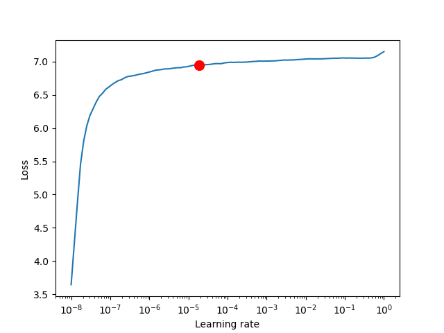
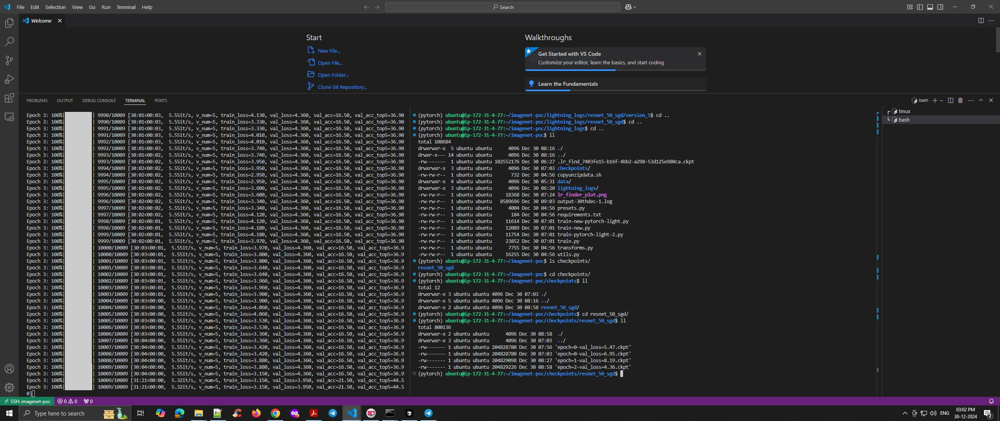
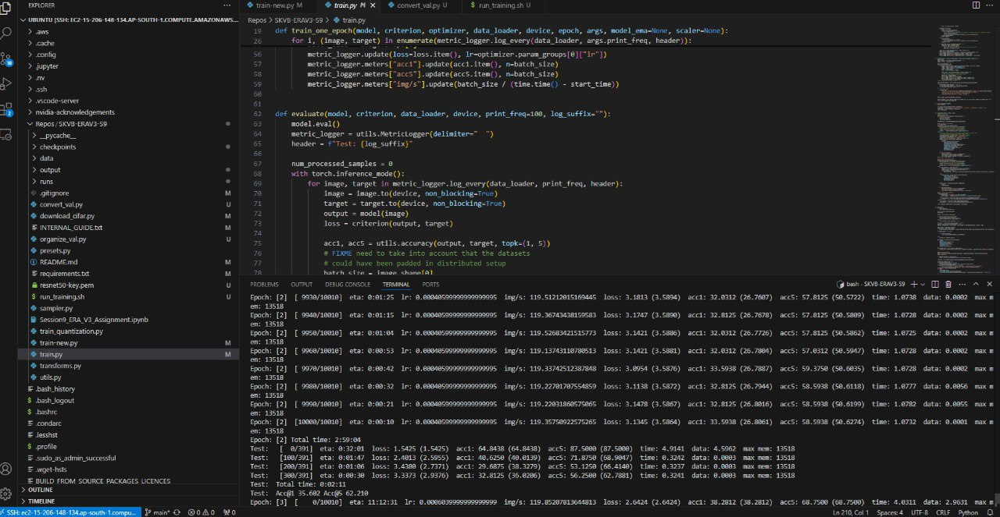

# Training Logs Visualization

## Learning Rate Finder Results

## Training Session 1 Logs

## Training Session 2 Logs

### Log Details
Each training session log shows:
- Training and validation loss
- Top-1 and Top-5 accuracy
- Learning rate progression
- GPU utilization metrics
